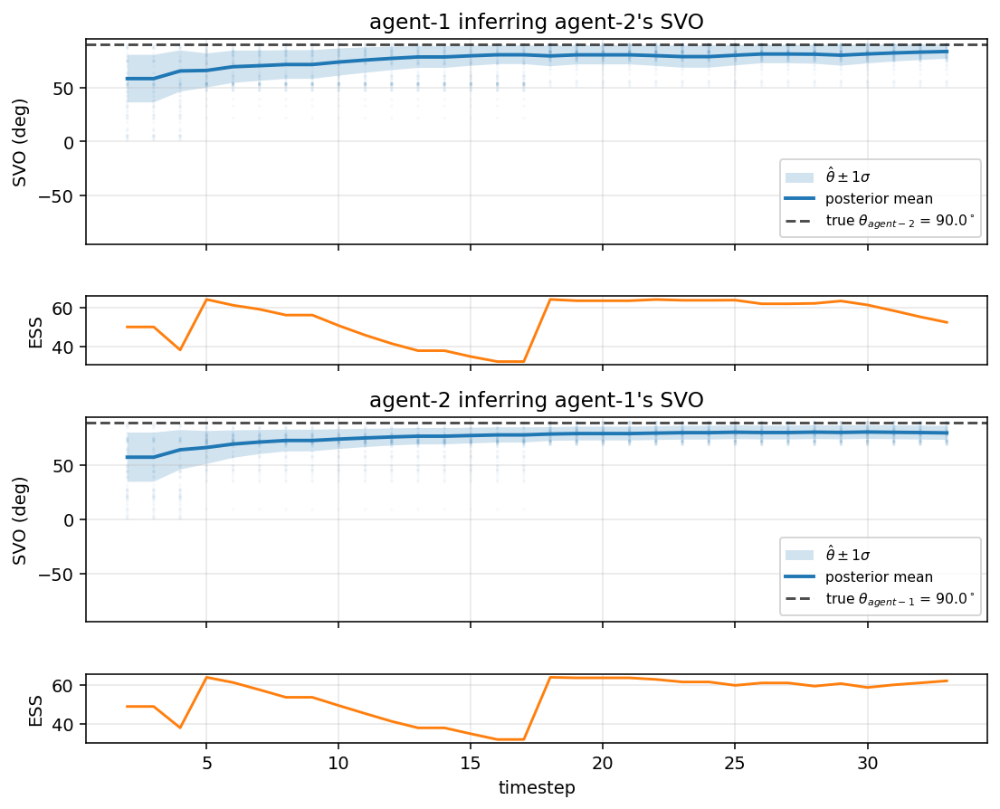
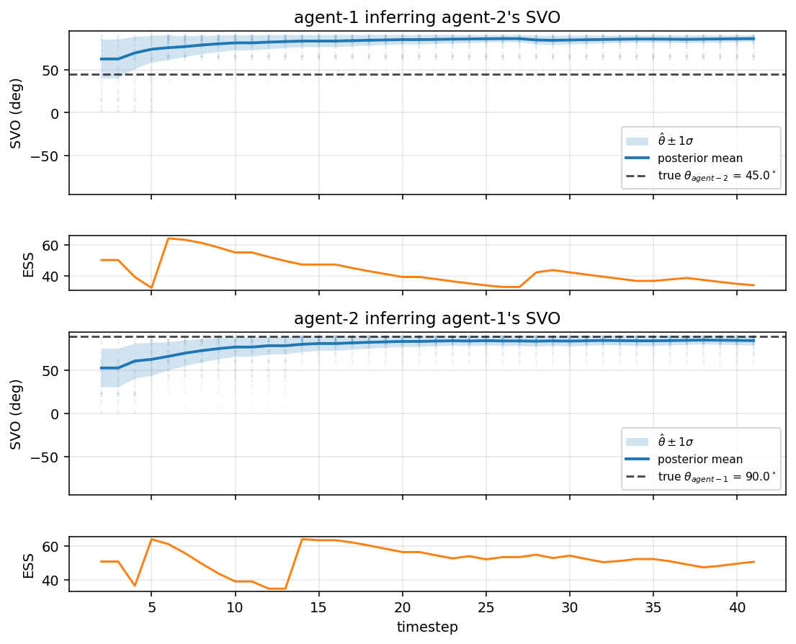
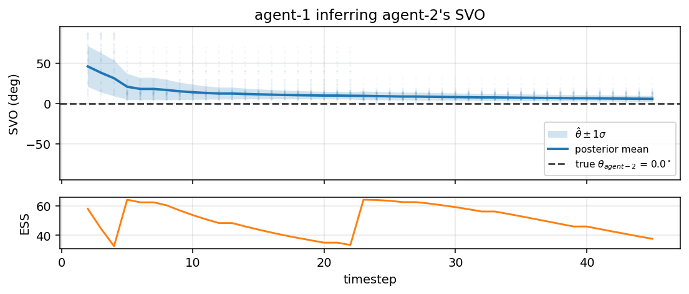

# Inferring Social Value Orientation in Multi-Agent Cooking Coordination


## Contributors  
- Bufan Gao
- Tianrun Wu
- Yufei Mao
- Jiabin Zou

## Introduction

> "Time's up! Holding a hotplate, don't mind me! Just burning my hands!"
> -Overcooked Player  
> "Ruined more friendships than +4 cards in uno, monopoly, and blue shells combined."
> -Anonymous Overcooked Review  

### 1. Motivation: Ever teamed with a Free-Rider?   
Teamwork matters in real-world tasks: conversation, group projects, cooperative games, etc. However, people have different personality and teammates **do NOT all contribute in the same way**. Some people prioritize team tasks, some hesitate, while some couldn't care less. Crucially, we can't read our teammate's mind directly. We have to **infer their tendencies** from observing their behaviors, and then make our own plans.

**Wu et al. (2021)** formalizes the problem with their **Bayesian Delegation** model, using an overcooked-inspired cooking game gridworld. Their model helps artificial agents coordinate in a cooking game by watching each other's actions and guessing what task the other agent is working on. In this way, the agents can divide labor without needing to talk to each other.


### 2. Current Project: heterogenous social preferences    
Our project extends on Wu et al.'s model by giving each cook a continuous **Social Value Orientation (SVO)** trait `theta` that controls how much it values its own effort versus team progress, and a partner can *infer* that trait from observed behavior using a particle filter.

> Built on top of [rosewang2008/gym-cooking](https://github.com/rosewang2008/gym-cooking)
> — *"Too many cooks: Bayesian inference for coordinating multi-agent collaboration."*
> Wu, S. A., Wang, R. E., Evans, J. A., Tenenbaum, J. B., Parkes, D. C.,
> Kleiman-Weiner, M. (2021). *Topics in Cognitive Science.*

## Core Idea

We represent each agent's social preference with  `theta ∈ [0, pi/2]`.      
It tells us what kind of teammate the agent is:    

| `theta` | Interpretation | Observable Behavior |
| --- | --- | --- |
| **0°** | Selfish | Sits at the corner, doesn't pick anything up, lets the partner cook alone |
| **45°** | Prosocial (≈ original BD) | Splits sub-tasks with the partner |
| **90°** | Altruistic | Walks to the next useful object every step, joins the partner at merges |

The utility form controls how much the agent weights its own effort cost versus team progress:  
`U_i(s, a; theta) = cos(theta) * r_self_i(s, a)  +  sin(theta) * r_team(s, a)`  
Or in plain language:  
`agent utility = weight on own effort + weight on team progress`
  
- When `theta` is low, `cos(theta)` is large, so the agent puts more weight on minimizing its own cost.  
- When `theta` is high, `sin(theta)` is large, so the agent puts more weight on helping the team make progress.  

Knowing one's own social preference doesn't solve the problems; we have to know what the others think to act in accordance. Each cook *also* maintains a belief about every partner's `theta` and uses the inferred value to decide who should do what. 

## Project Overview

Our project has two connected parts:

### Part 1: Decision-making with *known* SVO  
Each cook is assigned an SVO value. The value affects both the agent's own planning and how the delegator routes tasks to that agent.  
- The ego agent uses its belief about the partner's SVO to decide whether to wait for the partner or take over the work itself.  
- A "selfish" partner is more likely to be assigned `None`, and an altruistic partner is more likely to be assigned useful cooperative subtasks.

### Part 2: Inferring *unknown* SVO  
The partner's SVO is treated as hidden. Each agent maintains a particle-filter posterior over the partner's `theta`. After every observed partner action, the filter updates which candidate SVO values best explain the behavior. 
- Idle actions are stronger evidence for lower `theta`; purposeful movement towards useful subtasks is stronger evidence for higher `theta`.
- The posterior mean is fed back into the delegator, closing the loop between inference and planning.  

## Method

### 0) Basic Model Ingredients  

| Symbol | Meaning |
| --- | --- |
| `s_t` | World state at step t (positions, holdings, object states). |
| `a_{i,t}` | Agent `i`'s primitive move at step `t`. |
| `theta_i` | Agent `i`'s SVO (fixed per episode and hidden to others). |
| `beta` | Boltzmann rationality. Defaults to `arglist.beta = 1.3`. |
| `r_self_i` | Self-effort term, penalizing time and movement cost. |
| `r_team` | Team-progress term, rewarding movement toward useful subtasks |
| `N` | Number of particles used to represent the posterior over partner SVO. |
| `ESS` | Effective sample size, used to decide when to resample particles. |

### 1) Part 1: SVO-Conditioned Planning 
- *"If we already know each cook's SVO, how does that change behavior and task allocation?"*  

Remember that each agent combines an individual effort term with a team-progress term:  
`U_i(s, a; theta_i) = cos(theta_i) * r_self_i(s, a) + sin(theta_i) * r_team(s, a)`

Where:  
```
r_self_i(s, a) = -(time_cost + action_cost * 1{a_i != (0,0)})  
r_team(s, a)   = -lambda * d_after(s, a)
```

`d_after` represents the BFS distance from the agent's post-action position to the next subtask-relevant object. Low `theta` emphasizes avoiding individual effort; high `theta` emphasizes making team progress.

**Delegator SVO tilt** 

For every agent j, task allocation is weighted by the its SVO:  
```
tilt(j, subtask) = |sin(theta_j)|   if subtask is cooperative
                 = |cos(theta_j)|   if subtask == None
```
- Self: theta_j = self.svo
- Partners: partner_svo_estimates[j] for every partner

This means a selfish partner is more compatible with `None`, while an altruistic partner is more compatible with cooperative subtasks.
- If an ego agent believes its partner is selfish, it becomes more likely to assign itself the necessary work instead of waiting.

*Practical Notes:*  
- **SVO-dependent None policy:**  A selfish agent on the None subtask needs to actually stay put, otherwise its random-walk None-policy accidentally triggers interact() and the agent looks like it's helping. We scale none_action_prob = max(0.5, |cos(theta)|^0.5) so theta=0 gives prob=1.0 (always (0,0)).
- **Anti-deadlock prune:** When any plate in the world already has an ingredient on it (e.g. ChoppedTomato-Plate), allocations of the form Merge(<single ingredient>, Plate) are pruned. Without this, two cooperative agents grab a plate each, plate one ingredient apiece, and deadlock with two half-finished plates.

### 2) Part 2: Particle Filter for SVO Inference  
- *"If we do NOT know the partner's SVO, can we infer it from what it does?"*

Now, the partner's SVO is hidden:
```
theta_j ~ Uniform(0, pi/2)
```
The particle filter keeps many candidate values of `theta_j`. At each step t, it observes the partner's action and asks which particles best explains observed behavior. 
- Particles that predict the action well receives more weight, while particles that predict poorly lose weight.
The likelhood uses a mixture of two behavioral explanations (None-policy and BRTDP-Boltzmann):
```
P(a_{j,t} | s_t, theta_j) =
      |cos(theta_j)|  *  P(a | None policy under theta_j)
    + |sin(theta_j)|  *  P(a | BRTDP-Boltzmann on partner_subtask)
```
**Intuition:**  
- If the partner stays still: low-SVO particles become more likely.
- If the partner moves toward useful objects: high-SVO particles become more likely.
- If the evidence is ambiguous: the posterior remains uncertain.   

The Update Loop:


## Results

### Behavior Demo: Known SVO [Part 1]

We test on `open-divider_salad`, where two agents must prepare and deliver a tomato-and-lettuce salad. Steps should follow: Tomato + Lettuce → chop both → merge → plate →
deliver.  

Ego (agent-1, **blue cook**) is fixed at **Altruistic [theta = 90°]** in all three runs; the partner (agent-2, **magenta cook**) varies. All three **deliver the recipe**; only the step count and the partner's behavior differ.

|  Selfish partner (`theta_2 = 0°`)  |  Prosocial partner (`theta_2 = 45°`)  |  Altruistic partner (`theta_2 = 90°`)  |
| :---: | :---: | :---: |
|  |  |  |
| **45 steps.** Magenta stays put; blue carries the whole recipe alone. | **52 steps.** Both move; mid-range SVO has the most coordination friction. | **41 steps.** Tight cooperation -- both chop in parallel and meet at the plate. |

#### Key observations:

**1. Selfish and altruistic partners are visibly different.**  
The selfish partner literally doesn't help, while the altruistic one sprints to whatever is next needed.

**2. The Altruistic team is the Fastest.**  
When both agents contribute purposefully, they complete the recipe in 41 steps, compared to 45 steps when one of them act selfishly, a 9% speedup despite the extra coordination overhead.  

**3. The mid-range prosocial condition is (ironically) hardest.**  
Mid-range (theta=45) is the slowest of the three, potentially because both agents partly value self-effort and team progress, creating ambiguity in task allocation. Thus, they partially pursue overlapping tasks and increase the step count. 

### Inference Demo: Unknown Partner SVO [Part 2]

In the inference setting, agents do NOT receive the partner's SVO directly. Instead, each agent starts with a broad prior over `theta` and updates that belief from observed partner actions.

**Demo 1: Mutually Altruistic**  
In this demo, both agents are assigned as **Altruistic (`theta = 90°`)**. The figure shows two directions of inference: the top panel shows agent 1 inferring agent 2's SVO, and the bottom panel shows agent 2 inferring agent 1's SVO.



#### Interpretations:

**1. Both agents infer higher SVO from cooperative behaviors.**   
As steps progress, both agents observe cooperative behaviors that provide evidence for higher SVO, moving the posterior mean towards the true value of 90°. In other words, the agents gradually learn that their partner is likely to be *highly cooperative*.  

**2. Uncertainty decreases as evidence accumulates.**   
Shaded regions around the posterior mean represents uncertainty in the particle filter's belief. As more actions are observed, this uncertainty becomes narrower, suggesting the filter is becoming more confident about the partner's SVO.   

**3. ESS reflects particle concentration and resampling.**  
The orange ESS curve shows the effective sample size of the particle set. When ESS decreases, it means the posterior weight is concentrating on fewer particles; when it rises again, it reflects the resampling step that refreshes the particle set.


**Demo 2: Altruistic Agent and Prosocial Partner**  
In this case, agent 1 is still assigned as **Altruistic (`theta = 90°`)**, while agent 2 is assigned as **Prosocial (`theta = 45°`)**. Both Agent 1 and Agent 2 needs to infer the SVO of each other from observations.



#### Interpretations: 

**1. Both agents infer relatively high SVO from cooperative behaviors, but agent-1 overestimates the prosocial partner.**   
In this condition, the prosocial agent 2 made relatively accurate inference of the altruistic agent 1. Specifically, the posterior mean gradually approaches the true value of 90°, suggesting that agent 2 correctly learns that agent 1 is highly cooperative. However, agent 1’s inference of agent 2 is less accurate. Instead of converging toward the true 45° line, agent 1’s posterior mean rises well above 45° and stays closer to the high-SVO range. This suggests that the filter interprets agent 2’s cooperative behavior as evidence for a more altruistic SVO than the partner actually has.

**2. Uncertainty decreases as evidence accumulates, but confidence does not guarantee accuracy.**   
In both inference directions, the shaded band becomes narrower over time, suggesting that the filter becomes more confident as more actions are observed. However, when agent 1 inferring agent 2, uncertainty decreases around an estimate that is higher than the true 45° SVO. In other words, the filter becomes confident, but not fully accurate. This indicates that the current behavioral evidence may not be diagnostic enough to distinguish a moderately prosocial partner from a highly altruistic partner.

**Demo 3: Selfish Partner**  
For comparison, agent 1 is assigned as **Altruistic (`theta = 90°`)**, while agent 2 is assigned as **Selfish (`theta = 0°`)**. Agent 1 needs to infer the SVO of agent 2 from observations.



#### Interpretations: 

**1. Only the altruistic agent infers lower SVO from selfish behaviors.**   
Agent 1 successfully deciphers agent 2's behavior as less consistent with active cooperation. These observations shift the posterior mean toward lower SVO values. In this condition, the implementation treats agent 2 with `0° theta` as strongly selfish. Because of that, agent 2 may mostly choose idle or self-focused behavior, and the simulation may not produce or save a meaningful posterior trace for agent 2 is inferring agent 1.

**2. Uncertainty band shrinks as steps increase.**   
Similar to previous cases, the uncertainty band is wider in the beginning, meaning the filter is less certain about agent-2’s SVO. As more actions are observed, the band becomes narrower.

### Main Takeaways:
Overall, the trend supports the main purpose of Part 2: SVO does not have to be directly given to the agent. It can be **inferred from behavior**. In the altruistic-pair demo, cooperative movement pushes both agents' beliefs toward high SVO, which would allow the delegator to rely more on the partner in future task allocation. Conversely, when one agent is selfish, its partner would be able to detect the inconsistency in its actions to cooperative behaviors and decline its evaluation for its partner's SVO.


## Repo layout

```
gym_cooking/
  main.py                                # CLI: --svoN, --infer-svo, --n-particles
  utils/
    svo.py                               # SVO presets, parser
    agent.py                             # RealAgent reads theta; SVO-dep none_action_prob
  navigation_planner/planners/
    e2e_brtdp.py                         # opt-in SVO-weighted cost; team_progress shaping
  delegation_planner/
    bayesian_delegator.py                # per-partner SVO tilt; anti-deadlock prune; PF hook
    svo_particle_filter.py               # adding svo particle filter
  misc/metrics/
    metrics_bag.py                       # logs SVO state per step
    make_gif.py                          # frames -> GIF
    plot_svo_inference.py                # plots PF posterior trajectory
  experiments/run_svo.py                 # SVO sweep
images_svo/                              # figures (3 behavior GIFs + 1 inference plot)
SVO_PROJECT.md                           # this document
```

## How to run

From `gym_cooking/`:

```bash
# Behavior demo: altruistic ego, selfish partner
python main.py --num-agents 2 --level open-divider_salad \
    --model1 bd --model2 bd --svo1 90 --svo2 0 \
    --max-num-timesteps 100 --cap 25 --main-cap 15 \
    --seed 1 --record

# Once Part 2 lands, enable inference:
python main.py ... --infer-svo --n-particles 16
# (Until then it prints a one-line warning and falls back to the
#  CLI ground-truth partner_svo_estimates.)
```

Make a GIF from saved frames:
```bash
python -m misc.metrics.make_gif \
    --frames misc/game/record/<run_name> \
    --out ../images_svo/<file>.gif --duration 250
```

Plot the PF inference trajectory (needs Part 2):
```bash
python -m misc.metrics.plot_svo_inference \
    --pickle misc/metrics/pickles/<run>.pkl \
    --out ../images_svo/inference_traj.png
```


## Caveats and known limitations 

- **Mid-range SVO is the hardest case.** When the partner’s true SVO is θ = 45°, the SVO-based prior gives equal weight to selfish and cooperative tendencies, because |sin(45°)| and |cos(45°)| are both approximately 0.707. As a result, the MAP allocation can flip between different role assignments across timesteps, which may lead to unstable posterior updates. In applications, the current model may distinguish extreme SVO values better than intermediate SVO values. 
- **BRTDP caps were set low for speed.** The demonstration runs used --cap 25 and --main-cap 15, which made the simulations faster but may have produced noisier or less reliable planning estimates. More stable production runs should use the upstream defaults, such as --cap 75 and --main-cap 100.
- **The current results are based on a single seed.** All figures were generated using --seed 1, so the results may depend on one specific simulation trajectory. A stronger follow-up evaluation could run systematic SVO sweeps across multiple random seeds and summarize whether the posterior estimates reliably recover the true SVO values.

## Citation

```
@article{wu_wang2021too,
  author = {Wu, Sarah A. and Wang, Rose E. and Evans, James A. and
            Tenenbaum, Joshua B. and Parkes, David C. and
            Kleiman-Weiner, Max},
  title  = {Too many cooks: Coordinating multi-agent collaboration
            through inverse planning},
  journal = {Topics in Cognitive Science},
  year   = {2021},
  doi    = {10.1111/tops.12525},
}
```
