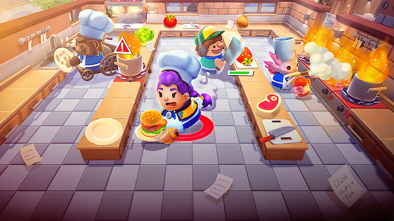
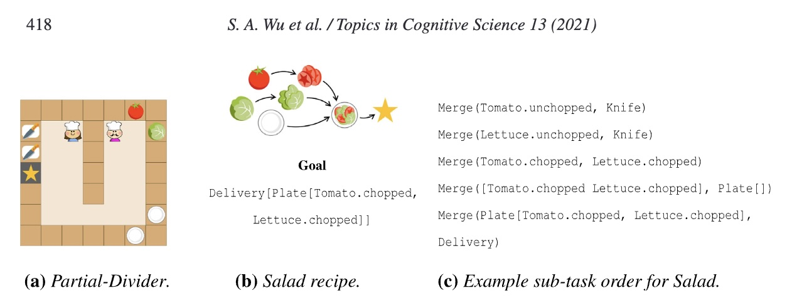
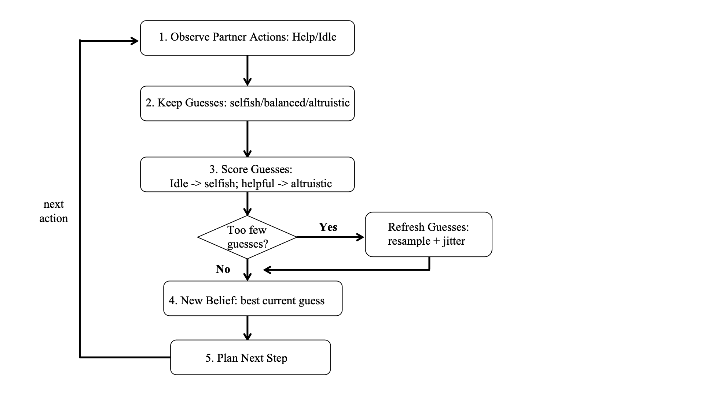
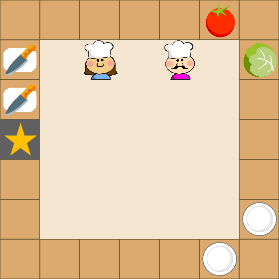
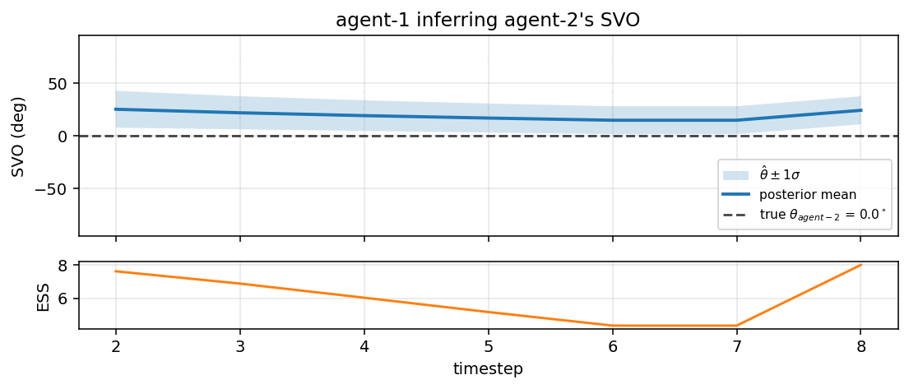

# Inferring Social Value Orientation in Multi-Agent Cooking Coordination



## Contributors  
- Bufan Gao
- Tianrun Wu
- Yufei Mao
- Jiabin Zou

## Introduction

> "Time's up! Holding a hotplate, don't mind me! Just burning my hands!"
> -Overcooked Player  
> "Ruined more friendships than +4 cards in uno, monopoly, and blue shells combined."
> -Anonymous Overcooked Review  

### 1. Motivation: Ever teamed with a Free-Rider?   
Teamwork matters in real-world tasks: conversation, group projects, cooperative games, etc. However, people have different personality and teammates **do NOT all contribute in the same way**. Some people prioritize team tasks, some hesitate, while some couldn't care less. Crucially, we can't read our teammate's mind directly. We have to **infer their tendencies** from observing their behaviors, and then make our own plans.

**Wu et al. (2021)** formalizes the problem with their **Bayesian Delegation** model, using an overcooked-inspired cooking game gridworld. Their model helps artificial agents coordinate in a cooking game by watching each other's actions and guessing what task the other agent is working on. In this way, the agets can divide labor without needing to talk to each other.



### 2. Current Project: heterogenous social preferences    
Our project extends on Wu et al.'s model by giving each cook a continuous **Social Value Orientation (SVO)** trait `theta` that controls how much it values its own effort versus team progress, and a partner can *infer* that trait from observed behavior using a particle filter.

> Built on top of [rosewang2008/gym-cooking](https://github.com/rosewang2008/gym-cooking)
> — *"Too many cooks: Bayesian inference for coordinating multi-agent collaboration."*
> Wu, S. A., Wang, R. E., Evans, J. A., Tenenbaum, J. B., Parkes, D. C.,
> Kleiman-Weiner, M. (2021). *Topics in Cognitive Science.*

## Core Idea

We represent each agent's social preference with  `theta ∈ [0, pi/2]`.      
It tells us what kind of teammate the agent is:    

| `theta` | Interpretation | Observable Behavior |
| --- | --- | --- |
| **0°** | Selfish | Sits at the corner, doesn't pick anything up, lets the partner cook alone |
| **45°** | Prosocial (≈ original BD) | Splits sub-tasks with the partner |
| **90°** | Altruistic | Walks to the next useful object every step, joins the partner at merges |

The utility form controls how much the ageny weights its own effort cost versus team progress:  
`U_i(s, a; theta) = cos(theta) * r_self_i(s, a)  +  sin(theta) * r_team(s, a)`  
Or in plain language:  
`agent utility = weight on own effort + weight on team progress`
  
- When `theta` is low, `cos(theta)` is large, so the agent puts more weight on minimizing its own cost.  
- When `theta` is high, `sin(theta)` is large, so the agent puts more weight on helping the team make progress.  

Knowing one's own social preference doesn't solve the problems; we have to know what the others think to act in accordance. Each cook *also* maintains a belief about every partner's `theta` and uses the inferred value to decide who should do what. 

## Project Overview

Our project has two connected parts:

### Part 1: Decision-making with *known* SVO  
Each cook is assigned an SVO value. The value affects both the agent's own planning and how the delegator routes tasks to that agent.  
- The ego agent uses its belief about the partner's SVO to decide whether to wait for the partner or take over the work itself.  
- A "selfish" partner is more likely to be assigned `None`, and an altruistic partner is more likely to be assigned useful cooperative subtasks.

### Part 2: Inferring *unknown* SVO  
The partner's SVO is treated as hidden. Each agent maintains a particle-filter posterior over the partner's `theta`. After every observed partner action, the filter updates which candidate SVO values best explain the behavior. 
- Idle actions are stronger evidence for lower `theta`; purposeful movement towards useful subtasks is stronger evidence for higher `theta`.
- The posterior mean is fed back into the delegator, closing the loop between inference and planning.  

## Method

### 0) Basic Model Ingredients  

| Symbol | Meaning |
| --- | --- |
| `s_t` | World state at step t (positions, holdings, object states). |
| `a_{i,t}` | Agent `i`'s primitive move at step `t`. |
| `theta_i` | Agent `i`'s SVO (fixed per episode and hidden to others). |
| `beta` | Boltzmann rationality. Defaults to `arglist.beta = 1.3`. |
| `r_self_i` | Self-effort term, penalizing time and movement cost. |
| `r_team` | Team-progress term, rewarding movement toward useful subtasks |
| `N` | Number of particles used to represent the posterior over partner SVO. |
| `ESS` | Effective sample size, used to decide when to resample particles. |

### 1) Part 1: SVO-Conditioned Planning 
- *"If we already know each cook's SVO, how does that change behavior and task allocation?"*  

Remember that each agent combines an individual effort term with a team-progress term:  
`U_i(s, a; theta_i) = cos(theta_i) * r_self_i(s, a) + sin(theta_i) * r_team(s, a)`

Where:  
```
r_self_i(s, a) = -(time_cost + action_cost * 1{a_i != (0,0)})  
r_team(s, a)   = -lambda * d_after(s, a)
```

`d_after` represents the BFS distance from the agent's post-action position to the next subtask-relevant object. Low `theta` emphasizes avoiding individual effort; high `theta` emphasizes making team progress.

**Delegator SVO tilt** 

For every agent j, task allocation is weighted by the its SVO:  
```
tilt(j, subtask) = |sin(theta_j)|   if subtask is cooperative
                 = |cos(theta_j)|   if subtask == None
```
- Self: theta_j = self.svo
- Partners: partner_svo_estimates[j] for every partner

This means a selfish partner is more compatible with `None`, while an altruistic partner is more compatible with cooperative subtasks.
- If an ego agent beileves its partner is selfish, it becomes more likely to assign itself the necessary work instead of waiting.

*Practical Notes:*  
- **SVO-dependent None policy:**  A selfish agent on the None subtask needs to actually stay put, otherwise its random-walk None-policy accidentally triggers interact() and the agent looks like it's helping. We scale none_action_prob = max(0.5, |cos(theta)|^0.5) so theta=0 gives prob=1.0 (always (0,0)).
- **Anti-deadlock prune:** When any plate in the world already has an ingredient on it (e.g. ChoppedTomato-Plate), allocations of the form Merge(<single ingredient>, Plate) are pruned. Without this, two cooperative agents grab a plate each, plate one ingredient apiece, and deadlock with two half-finished plates.

### 2) Part 2: Particle Filter for SVO Inference  
- *"If we do NOT know the partner's SVO, can we infer it from what it does?"*

Now, the partner's SVO is hidden:
```
theta_j ~ Uniform(0, pi/2)
```
The particle filter keeps many candidate values of `theta_j`. At each step t, it observes the partner's action and asks which particles best explains observed behavior. 
- Particles that predict the action well receives more weight, while particles that predict poorly lose weight.
The likelhood uses a mixture of two behavioral explanations (None-policy and BRTDP-Boltzmann):
```
P(a_{j,t} | s_t, theta_j) =
      |cos(theta_j)|  *  P(a | None policy under theta_j)
    + |sin(theta_j)|  *  P(a | BRTDP-Boltzmann on partner_subtask)
```
**Intuition:**  
- If the partner stays still: low-SVO particles become more likely.
- If the partner moves toward useful objects: high-SVO particles become more likely.
- If the evidence is ambiguous: the posterior remains uncertain.   

The Update Loop:




## Results

### Behavior Demo: Known SVO [Part 1]

We test on `open-divider_salad`, where two agents must prepare and deliver a tomato-and-lettuce salad. Steps should follow: Tomato + Lettuce → chop both → merge → plate →
deliver.  

Ego (agent-1, **blue cook**) is fixed at **Altruistic [theta = 90°]** in all three runs; the partner (agent-2, **magenta cook**) varies. All three **deliver the recipe**; only the step count and the partner's behavior differ.

|  Selfish partner (`theta_2 = 0°`)  |  Prosocial partner (`theta_2 = 45°`)  |  Altruistic partner (`theta_2 = 90°`)  |
| :---: | :---: | :---: |
|  |  |  |
| **45 steps.** Magenta stays put; blue carries the whole recipe alone. | **52 steps.** Both move; mid-range SVO has the most coordination friction. | **41 steps.** Tight cooperation -- both chop in parallel and meet at the plate. |

#### Key observations:

**1. Selfish and altruistic partners are visibly different.**  
The selfish partner literally doesn't help, while the altruistic one sprints to whatever is next needed.

**2. The Altruistic team is the Fastest.**  
When both agents contribute purposefully, they complete the recipe in 41 steps, compares to 45 steps when one of them act selfishly, a 9% speedup despite the extra coordination overhead.  

**3. The mid-range prosocial condition is (ironically) hardest.**  
Mid-range (theta=45) is the slowest of the three, potentially because both agents partly values self-effort and team progress, creating ambiguity in task allocation. Thus, they partially pursue overlapping tasks and increasing the step count. 

### Inference Demo: Unknown Partner SVO [Part 2]

In the inference setting, agents do NOT receive the partner's SVO directly. Instead, each agent starts with a broad prior over `theta` and updates that belief from observed partner actions.




Both posteriors climb from the prior mean (~45°) toward ~85° (truth
90°) and the std shrinks as evidence accumulates. ESS drops as the
posterior concentrates, with brief jumps at resampling events.

For the selfish-partner condition the posterior settles at +7°
(truth 0°) within 45 steps; for prosocial it overshoots to +87°
(truth 45°) — prosocial actions look very similar to altruistic when
the partner is also moving.

## Model specification

### Notation

| Symbol | Meaning |
| --- | --- |
| `s_t` | World state (positions, holdings, object states). |
| `a_{i,t}` | Agent `i`'s primitive move at step `t`. |
| `theta_i in [0, pi/2]` | Agent `i`'s SVO (fixed per episode, hidden to others). |
| `beta` | Boltzmann rationality. Defaults to `arglist.beta = 1.3`. |

### Generative model (Part 1)

Per-agent utility:
```
U_i(s, a; theta_i) = cos(theta_i) * r_self_i(s, a)  +  sin(theta_i) * r_team(s, a)

r_self_i(s, a) = -(time_cost + action_cost * 1{a_i != (0,0)})
r_team(s, a)   = -lambda * d_after(s, a)
```
where `d_after` is the BFS distance from the post-action position to
the next subtask-relevant object. Real action selection uses the
original BD cost (`use_svo_cost=False`); the SVO-weighted cost is
reserved for the particle filter's per-particle likelihood evaluation.

**Delegator SVO tilt.** Each candidate allocation is weighted by, for
*every* agent `j` in the allocation:

```
tilt(j, subtask) = |sin(theta_j)|   if subtask is cooperative
                 = |cos(theta_j)|   if subtask == None
```

`theta_j = self.svo` for self and `partner_svo_estimates[j]` for
partners. An altruistic ego that believes its partner is selfish will
have a MAP allocation that puts the partner on `None` and assigns
itself every cooperative subtask — that's what makes the
selfish-partner condition deliver at all.

**SVO-dependent `none_action_prob`.** A selfish agent on the None
subtask needs to *actually* stay put, otherwise its random-walk
None-policy accidentally triggers `interact()` and the agent looks
like it's helping. We scale
`none_action_prob = max(0.5, |cos(theta)|^0.5)` so `theta=0` gives
`prob=1.0` (always `(0,0)`).

**Anti-deadlock prune.** When *any* plate in the world already has an
ingredient on it (e.g. `ChoppedTomato-Plate`), allocations of the form
`Merge(<single ingredient>, Plate)` are pruned. Without this, two
cooperative agents grab a plate each, plate one ingredient apiece,
and deadlock with two half-finished plates.

### Inference model (Part 2, **TODO**)

Hidden:   `theta_j ~ Uniform(0, pi/2)`

The prior is non-negative because the rest of the model is **symmetric
in sign** (`|sin|`, `|cos|` everywhere). A `[-pi/2, pi/2]` prior would
leak probability mass into the negative half that no observation can
identify.

Likelihood (mixture of None-policy and BRTDP-Boltzmann under the
partner's subtask):
```
P(a_{j,t} | s_t, theta_j) =
      |cos(theta_j)|  *  P(a | None policy under theta_j)
    + |sin(theta_j)|  *  P(a | BRTDP-Boltzmann on partner_subtask)
```

The mixing weights are the key discriminator. A pure-BRTDP likelihood
fails because BRTDP's argmin is "walk toward goal" under almost every
theta. Mixing in the None-policy (weighted by `|cos(theta)|`) creates
real signal: idle observations strongly favor low theta; purposeful
moves strongly favor high theta.

SMC update: see the module docstring of
[`gym_cooking/delegation_planner/svo_particle_filter.py`](gym_cooking/delegation_planner/svo_particle_filter.py).

## Repo layout

```
gym_cooking/
  main.py                                # CLI: --svoN, --infer-svo, --n-particles
  utils/
    svo.py                               # SVO presets, parser
    agent.py                             # RealAgent reads theta; SVO-dep none_action_prob
  navigation_planner/planners/
    e2e_brtdp.py                         # opt-in SVO-weighted cost; team_progress shaping
  delegation_planner/
    bayesian_delegator.py                # per-partner SVO tilt; anti-deadlock prune; PF hook
    svo_particle_filter.py               # ** Part 2 -- TODO stub **
  misc/metrics/
    metrics_bag.py                       # logs SVO state per step
    make_gif.py                          # frames -> GIF
    plot_svo_inference.py                # plots PF posterior trajectory
  experiments/run_svo.py                 # SVO sweep
images_svo/                              # figures (3 behavior GIFs + 1 inference plot)
SVO_PROJECT.md                           # this document
```

## How to run

From `gym_cooking/`:

```bash
# Behavior demo: altruistic ego, selfish partner
python main.py --num-agents 2 --level open-divider_salad \
    --model1 bd --model2 bd --svo1 90 --svo2 0 \
    --max-num-timesteps 100 --cap 25 --main-cap 15 \
    --seed 1 --record

# Once Part 2 lands, enable inference:
python main.py ... --infer-svo --n-particles 16
# (Until then it prints a one-line warning and falls back to the
#  CLI ground-truth partner_svo_estimates.)
```

Make a GIF from saved frames:
```bash
python -m misc.metrics.make_gif \
    --frames misc/game/record/<run_name> \
    --out ../images_svo/<file>.gif --duration 250
```

Plot the PF inference trajectory (needs Part 2):
```bash
python -m misc.metrics.plot_svo_inference \
    --pickle misc/metrics/pickles/<run>.pkl \
    --out ../images_svo/inference_traj.png
```

## TODO list for Part 2

Everything you need is in
[`gym_cooking/delegation_planner/svo_particle_filter.py`](gym_cooking/delegation_planner/svo_particle_filter.py).
The methods marked `TODO (part2)` are:

1. `__init__` — initialise `self.particles` from the uniform prior and
   `self.weights` uniform `1/N`.
2. `update(...)` — one SMC step (per-particle likelihood, normalise,
   resample on low ESS, append diagnostic to `self.trace`).
3. `posterior_mean / posterior_std / map_estimate / ess`.
4. `_likelihood(...)` — the mixture
   `|cos(theta)| * P(a | None) + |sin(theta)| * P(a | BRTDP under theta)`.
   `SVOParticleFilter.none_action_prob_for(theta)` is already provided
   and matches the partner's real None-policy.
5. `_resample` — multinomial with Gaussian jitter, clip to prior range,
   reset weights.

The integration is already wired: `BayesianDelegator._update_svo_filters`
calls `pf.update(...)` once per step per partner, then slow-blends
`pf.posterior_mean()` into `partner_svo_estimates[partner]`
(alpha=0.15). The bag logger snapshots `pf.particles / weights / mean /
std / ess` each step.

A working reference implementation lived on this file in commit
`89017fb` (before the strip):
```bash
git show 89017fb:gym_cooking/delegation_planner/svo_particle_filter.py
```

### Sanity checks for Part 2

- Partner SVO = 0°, ego SVO = 90°, `--infer-svo` on: posterior should
  settle near 0° with small std within ~20 timesteps.
- Partner SVO = 90°: posterior should climb toward +90° over ~25
  timesteps (this is the figure embedded above).
- If the posterior never moves: check that `_likelihood` is calling
  `planner.set_svo(theta)` before `planner.set_settings`.

## Caveats and known limitations

- **Mid-range SVO is the hardest case.** With `theta=45`, the
  per-partner tilt is `|sin|=|cos|=0.707` so MAP allocation can flip
  between roles step-to-step, leading to thrashing.
- **BRTDP caps are low for speed** (`--cap 25 --main-cap 15`).
  Production runs should use the upstream defaults
  (`--cap 75 --main-cap 100`).
- **Single seed.** All figures are from `--seed 1`. A proper sweep
  is left as a follow-up.

## Citation

```
@article{wu_wang2021too,
  author = {Wu, Sarah A. and Wang, Rose E. and Evans, James A. and
            Tenenbaum, Joshua B. and Parkes, David C. and
            Kleiman-Weiner, Max},
  title  = {Too many cooks: Coordinating multi-agent collaboration
            through inverse planning},
  journal = {Topics in Cognitive Science},
  year   = {2021},
  doi    = {10.1111/tops.12525},
}
```
