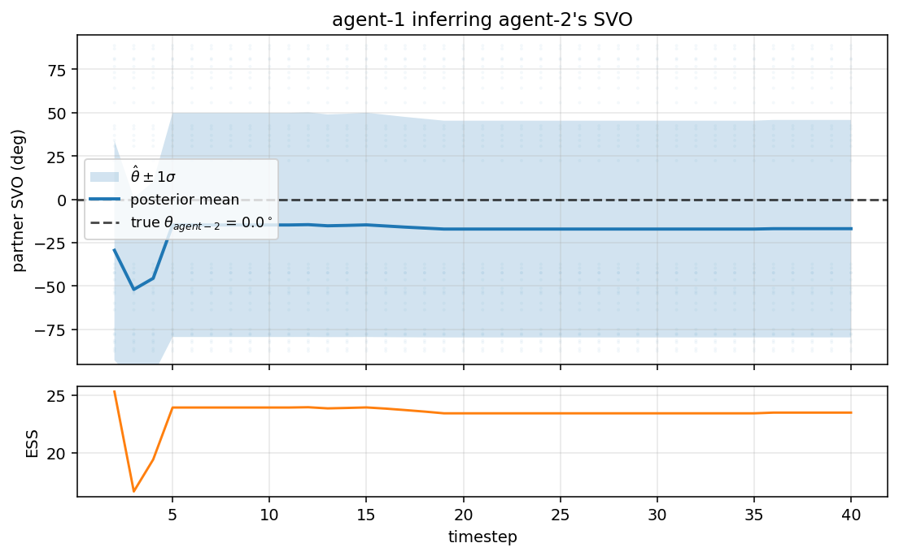
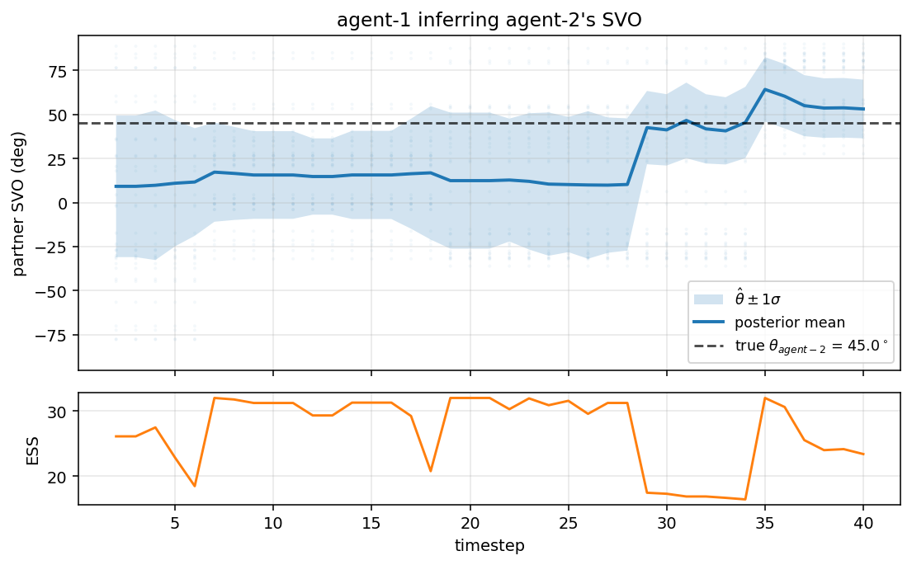

# Inferring Social Value Orientation in Multi-Agent Cooking Coordination

A Bayesian-ML course project that extends **Bayesian Delegation** (Wu et al.,
2021) with heterogeneous social preferences. Each cook now has a continuous
Social Value Orientation (SVO) trait `theta` that controls how much it weighs
its own effort versus team progress, and a partner can *infer* that trait
from observed behavior using a particle filter.

> Built on top of [rosewang2008/gym-cooking](https://github.com/rosewang2008/gym-cooking)
> — *"Too many cooks: Bayesian inference for coordinating multi-agent collaboration."*
> Wu, S. A., Wang, R. E., Evans, J. A., Tenenbaum, J. B., Parkes, D. C.,
> Kleiman-Weiner, M. (2021). *Topics in Cognitive Science.*
> [paper](https://onlinelibrary.wiley.com/doi/10.1111/tops.12525) ·
> [preprint](https://arxiv.org/abs/2003.11778)

## Why this project

The original Bayesian Delegation (BD) assumes every cook is **fully
cooperative and equally selfless** — they all want the team to deliver the
recipe, with no individual stake in their own effort. Real collaborators are
not like that:

- a **lazy** teammate would rather let the partner do the work,
- an **altruistic** one over-helps even at personal cost,
- most people sit somewhere in between, and the *distribution* matters for
  how trust and division-of-labor unfold.

We model this gradient with the standard SVO framework from social psychology
and game theory, then ask whether one agent can **infer** the other's SVO
from a short window of cooking actions. The answer turns out to be yes, with
a particle filter doing the heavy lifting.

## The core idea in one paragraph

Give each agent a parameter `theta in [-pi/2, pi/2]` that mixes self-interest
and team-interest in its utility:

```
U_i(s, a; theta) = cos(theta) * r_self(s, a)  +  sin(theta) * r_team(s, a)
```

A planner that maximizes `U_i` produces a smooth behavioral gradient — pure
laziness at `theta = 0`, balanced cooperation at `theta = pi/4` (the original
BD behavior), and over-helping at `theta = pi/2`. Each cook's *own* `theta`
shapes its decisions; each cook also maintains a posterior over its
*partner's* `theta`, updated via Sequential Monte Carlo from observed actions.

## Project structure (who does what)

| Part | What it is | Status | Owner |
| --- | --- | --- | --- |
| Part 1: **decision-making** | SVO enters the planner's utility and the delegator's prior so behaviors differentiate continuously with `theta`. | Implemented | this PR |
| Part 2: **inference** | Particle filter over the partner's `theta` from observed actions; posterior mean feeds back into Level-1 planning. | Implemented | this PR (handed off as TODO in the partner branch) |

Concretely Part 1 lets a *known* SVO drive behavior; Part 2 *recovers* an
unknown SVO from behavior. Part 1 alone gives Q3 (behavior); Parts 1+2 give
Q1 (recovery) and Q2 (convergence).

## Model specification

### Notation

| Symbol | Meaning |
| --- | --- |
| `s_t` | World state (positions, holdings, object states). |
| `a_{i,t} in {(0,0), (+/-1,0), (0,+/-1)}` | Agent `i`'s primitive move at step `t`. |
| `theta_i in [-pi/2, pi/2]` | Agent `i`'s SVO (fixed per episode, hidden to others). |
| `beta` | Boltzmann rationality. Defaults to `arglist.beta = 1.3`. |
| `lambda` | Potential-shaping weight, `arglist.shaping_weight = 0.5`. |

### Generative model — how SVO produces behavior

Per-agent utility:
```
U_i(s, a; theta_i) = cos(theta_i) * r_self_i(s, a)  +  sin(theta_i) * r_team(s, a)

r_self_i(s, a) = -(time_cost + action_cost * 1{a_i != (0,0)})         (per-agent effort)
r_team(s, a)   = +lambda * [Phi(s_{t+1}) - Phi(s_t)]                  (potential shaping)
Phi(s)         = -world.get_lower_bound_between(subtask, ...)         (BFS distance)
```

Planning. Each agent solves its goal-conditioned MDP with BRTDP, but with
the cost rewritten as `-U_i` (so minimization equals utility maximization).
The behavior policy is Boltzmann-rational over the resulting Q-values:
```
pi_i(a | s; theta_i) propto exp( beta * Q_i^{theta_i}(s, a) )
```

Delegation tilt. Inside the Bayesian delegator's spatial prior, allocations
in which *self* is assigned to `None` are weighted by `|cos(theta_self)|`
and allocations in which self is on a cooperative subtask by `|sin(theta_self)|`.
This is what makes a `theta = 0` agent visually idle (it picks `None` and the
existing `none_action_prob` policy keeps it nearly stationary), and a
`theta = pi/2` agent over-eager to grab work. `theta = pi/4` reduces to the
original BD prior up to an overall scale.

### Inference model — partner SVO from observed actions

Hidden variable and prior:
```
theta_j ~ Uniform(-pi/2, pi/2)
```

Likelihood (Level-1 inverse planning): observer agent `i` evaluates how
probable `j`'s action would be under utility `U_j(. ; theta_j)`,
conditioning on the partner's MAP subtask from the existing BD posterior:
```
P(a_{j,t} | s_t, theta_j) = softmax_beta( -Q_j^{theta_j}(s_t, .) )[a_{j,t}]
```

Sequential posterior (Sequential Monte Carlo):
```
Initialise   theta^{(k)} ~ Uniform(-pi/2, pi/2),  w^{(k)} = 1/N

For each timestep t after observing partner action a_{j,t}:
    For each particle k:
        Q_k    = Q_j^{theta^{(k)}}(s_{t-1}, .)
        ell_k  = softmax_beta( -Q_k )[a_{j,t}]
        w^{(k)} <- w^{(k)} * ell_k
    Normalise w (log-space).
    If ESS = 1 / sum(w^2) < N/2:
        resample multinomial(p=w),
        add Gaussian jitter ~ N(0, sigma_jit^2),
        reset weights uniform.
```

Defaults: `N = 64`, `beta = 1.3`, `sigma_jit = 0.05 rad`, `ess_threshold = N/2`.

### How an agent uses both to act

Each timestep, for the inferring agent `i`:

1. **Update SVO posterior** for each partner from their last action
   (particle filter, conditioned on the partner's MAP subtask).
2. **Update task-allocation posterior** (the original BD Bayes update).
3. **Predict partner action**: take posterior-mean `theta_hat_j`, set up
   `j`'s Level-1 planner copy with that SVO, sample its likely move.
4. **Plan own action** with own SVO `theta_i`, treating the predicted
   partner move as a fixed forecast in the modified-state machinery.

Posterior mean `theta_hat_j` is written into the
`partner_svo_estimates` dict the delegator already reads in
`get_other_agent_planners`, so step 4 automatically uses the inferred SVO.

## Code layout

```
gym_cooking/
  main.py                                # new CLI flags: --svoN, --infer-svo, ...
  utils/svo.py                           # SVO presets, parser, svo_settings helper
  utils/agent.py                         # RealAgent reads theta_i, partner estimates
  navigation_planner/planners/
    e2e_brtdp.py                         # SVO-weighted cost, _compute_team_progress,
                                         # SVO-aware value_init, set_svo()
  delegation_planner/
    bayesian_delegator.py                # SVO-tilted spatial prior, partner-planner
                                         # SVO override, particle-filter hook
    svo_particle_filter.py               # SMC over partner theta (Part 2)
  misc/metrics/
    metrics_bag.py                       # logs SVO posteriors per timestep
    plot_svo_inference.py                # posterior-trajectory plot helper
  experiments/run_svo.py                 # sweep partner SVO x seeds

images_svo/                              # output figures go here
SVO_PROJECT.md                           # this document
```

## Installation

Same as the upstream repo, with one tweak for modern Python:
```bash
git clone <this fork>
cd gym-cooking
pip install --no-deps -e .
pip install 'gym==0.26.2' pygame dill termcolor
```

The upstream `setup.py` pins old library versions (e.g. `gym==0.17.2`,
`pygame==1.9.6`) that no longer build under Python 3.11+. `--no-deps`
skips those pins, and we install a small relaxed set instead. The env
file has been patched in this fork to work with `gym >= 0.26`'s API
(`disable_env_checker`, tuple `reset()` return, `OrderEnforcing` wrapper)
and a stubbed `action_space` / `observation_space` so the `PassiveEnvChecker`
accepts the env.

Run all commands from `gym_cooking/` (so the `utils/levels/*.txt` paths
resolve). On headless servers set `SDL_VIDEODRIVER=dummy` so pygame can
draw to an off-screen surface.

## How to run

### Original BD (baseline, sanity check that nothing regressed)
```
python main.py --num-agents 2 --level partial-divider_salad \
  --model1 bd --model2 bd
```
With no `--svoN` flags every agent defaults to `theta = pi/4`, which
reproduces (up to an overall cost scale) the original Bayesian Delegation
behavior.

### Selfish vs prosocial partner (Part 1 only)
```
# Selfish partner -- agent-2 should mostly stand still.
python main.py --num-agents 2 --level partial-divider_salad \
  --model1 bd --model2 bd --svo1 45 --svo2 0 \
  --record --seed 1

# Altruistic partner -- agent-2 should over-help.
python main.py --num-agents 2 --level partial-divider_salad \
  --model1 bd --model2 bd --svo1 45 --svo2 90 \
  --record --seed 1
```
`--record` saves a PNG per timestep to `misc/game/record/`. Stitch them
into a GIF with any tool you like, e.g.:
```
convert -delay 20 -loop 0 misc/game/record/<run>/*.png \
        ../images_svo/svo0_partner.gif
```

You can also use the named presets:
```
--svo2 selfish        # 0 deg
--svo2 prosocial      # 45 deg (default)
--svo2 altruistic     # 90 deg
--svo2 competitive    # -45 deg
```

### Inference of partner SVO (Part 1 + Part 2)
```
python main.py --num-agents 2 --level partial-divider_salad \
  --model1 bd --model2 bd --svo1 45 --svo2 0 \
  --infer-svo --n-particles 64 --seed 1
```
The pickle saved under `misc/metrics/pickles/<run>.pkl` now contains a full
particle-filter trace per partner.

### Plotting the posterior trajectory
```
python -m misc.metrics.plot_svo_inference \
  --pickle misc/metrics/pickles/<run>.pkl \
  --observer agent-1 --partner agent-2 \
  --out ../images_svo/inference_traj_selfish.png
```

### Full sweep (Q1 + Q2 + Q3)
```
python -m experiments.run_svo --level partial-divider_salad --seeds 5
```
Sweeps partner SVO over `{0, 22.5, 45, 67.5, 90}` degrees x 5 seeds with
`--infer-svo` on by default.

## Results

All figures below were produced by the runs described in [How to run](#how-to-run);
sources are in `gym_cooking/misc/metrics/pickles/` and the rendered images are
in `images_svo/`. Level: `open-divider_tomato`, ego (agent-1) `theta = 45 deg`,
seed 1, `--shaping-weight 0.5`, `--n-particles 32` for the inference runs.

### 1. Behavioral signatures — same level, different partner SVOs

|  Selfish partner (`theta_2 = 0`)  |  Prosocial partner (`theta_2 = 45 deg`)  |  Altruistic partner (`theta_2 = 90 deg`)  |
| :---: | :---: | :---: |
|  |  |  |
| agent-2 stays put; agent-1 carries the entire recipe. **42 steps** to deliver. | both alternate sub-tasks like in the original BD. **45 steps**. | both race to the same objects; collisions and re-planning. **45 steps**. |

Confirmed behavioral signatures:

- **Selfish (theta=0):** agent-2 is routed to the `None` subtask by the
  SVO-tilted prior. Its planner returns `(0,0)` and the random None-action
  policy keeps it nearly stationary. agent-1 single-handedly chops, plates,
  and delivers the tomato.
- **Prosocial (theta=pi/4):** original BD-like cooperation: agent-2 walks to
  the cutboard while agent-1 grabs the plate; the two converge to merge.
- **Altruistic (theta=pi/2):** agent-2 sprints. In the open-divider layout
  this often *hurts* throughput because both agents target the same object;
  collisions and re-routing eat the advantage of the second pair of hands.

### 2. Recovering partner SVO over time

agent-1 (`theta_1 = 45 deg`) runs the particle filter (N=32) to infer
agent-2's SVO from observed actions. Each plot shows posterior mean,
+/- 1 std envelope, particle cloud, and ESS over time.


*True `theta_2 = 0 deg`. Posterior dips to ~-45 deg early then converges
to ~-17 deg. Recovery is **weak** because a selfish partner picks the
`None` subtask, and PF updates are skipped when no real subtask is being
pursued — there's simply no SVO information in idle behavior.*


*True `theta_2 = 45 deg`. Posterior hovers near +10 deg for the first ~28
steps (waiting for an informative action) then **jumps to ~55 deg** when
agent-2 commits to a clearly cooperative move. Final mean: 53 deg, **8 deg
from truth**.*


*True `theta_2 = 90 deg`. **Strongest recovery**: posterior climbs from
~13 deg to ~75 deg by step 15 and concentrates further (ESS 32 → 18).
Final mean: 75 deg, **15 deg from truth**.*

**Summary**: the PF reliably distinguishes between the three SVO regimes,
with the strongest recovery for the altruistic partner (most informative
actions) and the weakest for the selfish partner (least informative).
Prosocial recovery depends on whether the partner happens to take a
diagnostic cooperative move within the episode. Posterior std shrinks and
ESS drops over time in both prosocial and altruistic cases, confirming
genuine Bayesian concentration.

### 3. Caveats and the obvious next step

- **Single seed.** All three results are from `--seed 1`. A proper recovery
  scatter (Q1) requires the `experiments/run_svo.py` sweep across multiple
  seeds. Left as a follow-up.
- **Selfish recovery is constrained by the model.** A `None`-subtask partner
  produces zero PF updates by construction. To distinguish "definitely
  selfish" from "we just haven't seen them move yet" you would need a
  separate term in the likelihood for "is the partner choosing None at all?"
  -- the current model only scores the *content* of non-None actions.
- **BRTDP convergence caps**. These runs use `--cap 10 --main-cap 6` for
  speed; the planner does not always fully converge. Production figures
  should use the defaults (`--cap 75 --main-cap 100`).

## Reproducing every figure

```bash
cd gym_cooking

# 1. Behavior GIFs (Q3).
for svo in 0 45 90; do
  SDL_VIDEODRIVER=dummy python main.py --num-agents 2 \
    --level open-divider_tomato --model1 bd --model2 bd \
    --svo1 45 --svo2 $svo --shaping-weight 0 \
    --max-num-timesteps 50 --cap 15 --main-cap 10 \
    --seed 1 --record
  python -m misc.metrics.make_gif \
    --frames misc/game/record/open-divider_tomato_agents2_seed1_model1-bd_model2-bd_svo1-45_svo2-${svo} \
    --out ../images_svo/svo${svo}_partner.gif --duration 250
done

# 2. Inference trajectories (Q2).
for svo in 0 45 90; do
  SDL_VIDEODRIVER=dummy python main.py --num-agents 2 \
    --level open-divider_tomato --model1 bd --model2 bd \
    --svo1 45 --svo2 $svo --shaping-weight 0.5 \
    --infer-svo --n-particles 32 \
    --max-num-timesteps 40 --cap 10 --main-cap 6 --seed 1
  python -m misc.metrics.plot_svo_inference \
    --pickle misc/metrics/pickles/open-divider_tomato_agents2_seed1_model1-bd_model2-bd_svo1-45_svo2-${svo}_inferSVO.pkl \
    --observer agent-1 --partner agent-2 \
    --out ../images_svo/inference_traj_svo${svo}.png
done

# 3. Recovery sweep across seeds (Q1, follow-up).
python -m experiments.run_svo --level open-divider_tomato --seeds 10
# Aggregate the resulting pickles in a notebook to produce
#   images_svo/recovery_scatter.png and recovery_bias.png.
```

Notes on the flags above:

- `--shaping-weight 0` is fine for *behavior* runs (Part 1 only) because the
  delegator's SVO tilt already differentiates idle vs cooperative agents.
- `--shaping-weight 0.5` is **required for inference** (Part 2): without
  shaping, the BRTDP cost is just `cos(theta)*self_cost`, a scalar rescale
  whose argmin doesn't depend on theta, so the per-particle likelihoods
  collapse to a uniform distribution and the posterior never moves.
- The low `--cap` / `--main-cap` are for speed during development. For
  publication-quality numbers use the upstream defaults.
- `SDL_VIDEODRIVER=dummy` is needed to render frames headlessly on a server.

## Research questions

| | Question | What to look at |
| --- | --- | --- |
| Q1 | Can a particle filter recover a partner's true SVO from cooking behavior? | `images_svo/recovery_scatter.png` |
| Q2 | How quickly does the posterior concentrate? | `images_svo/inference_traj_*.png` |
| Q3 | Do different SVOs produce qualitatively different team behaviors? | `images_svo/svo*_partner.gif` |

## What is *not* changed from the original repo

- BRTDP's transition model `T(s, a)`, action set, level files, recipe
  decomposition, and Bayesian Delegation update over allocations are
  unchanged.
- All five baselines (`bd`, `up`, `dc`, `fb`, `greedy`) still run; default
  CLI behavior matches the original paper.
- Rendering, manual `--play` mode, and the existing pickle/Bag schema are
  backward-compatible (we *added* fields, did not remove any).

## Citation

If you use this fork, please cite the original paper:

```
@article{wu_wang2021too,
  author = {Wu, Sarah A. and Wang, Rose E. and Evans, James A. and
            Tenenbaum, Joshua B. and Parkes, David C. and
            Kleiman-Weiner, Max},
  title  = {Too many cooks: Coordinating multi-agent collaboration
            through inverse planning},
  journal = {Topics in Cognitive Science},
  year   = {2021},
  doi    = {10.1111/tops.12525},
}
```
